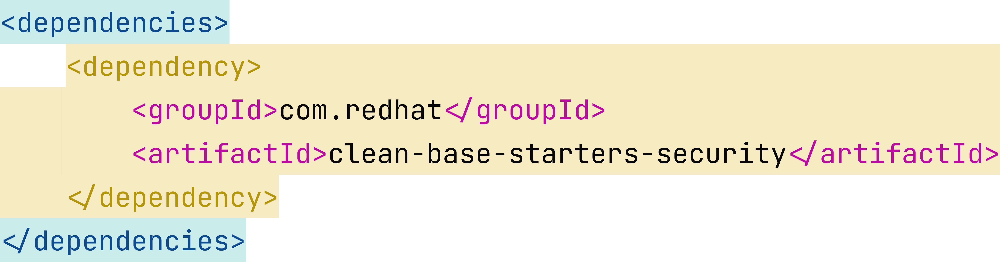
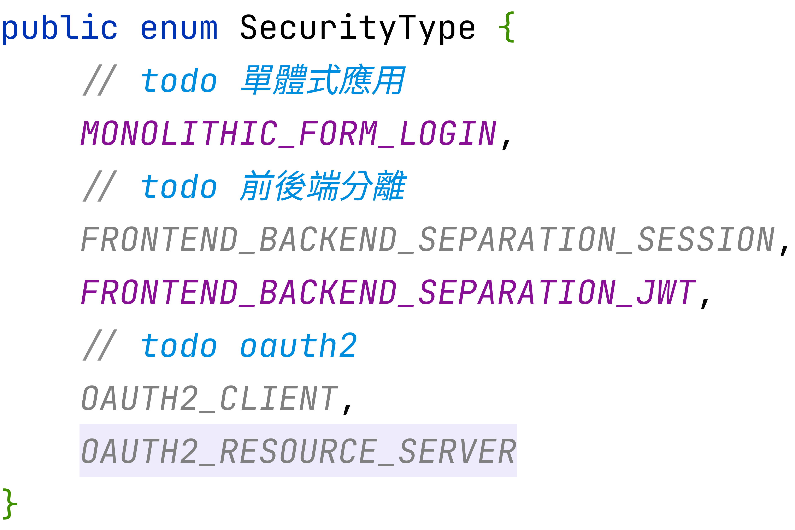
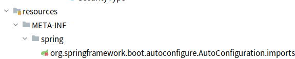
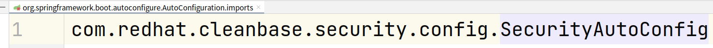

# ca base security starter

## 概覽

包裝 官方 spring security starter
為開發者方便設定的 spring boot starter

### 背景介紹

讓開發者輕鬆使用 spring security ,
不要對其繁複設定產生恐懼

### 引入本套件方式

本套件基於 maven 套件管理工具 ,
目前未放入 maven remote 倉庫 ,
專案引入需做以下設定:

### 測試方式

未來會搭配 spring security 提供之測試方式做編寫
且如能共用 , 會設計並放入測試模組供使用

### 規劃與實做
將可共用之 security 設定讓開發者或部屬人員在 spring boot application.yml(properties)
設定 , 不必編寫 java config 配置 , 

目前包含的共用設定如下:

- cors (瀏覽器非同步請求跨域設定)
- logout (目前僅開放設定 logout url)
- ignore (設定不走 spring security)
- header (針對 response security header 做放置)
    - csp
    - frame-options
- session (目前只針對 session 創建機制做配置)
- authorizeRequest (針對 url pattern, httpMethod 設定認證授權條件)
- security type (自定義 , 方便開發者選擇 security 流程)

security type 是專案主要 security 設定:

它決定了專案要用哪種 security 的方式運作

底層會提供 security 流程供選擇
並針對每個 security 流程做相對應的配置

專案只需在設定檔設定即可享有基本配置

如需客製再進行覆蓋相關配置的 bean

#### starter 註冊方式

#### starter 自動配置類

